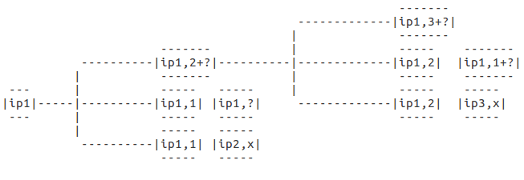

**Assumptions:**

1-Data in the CSV file is grouped by (in the SQL sense):
First by the ip
Second by the time (hours,min,sec)
My code uses this format in the CSV file. Of course we can always
use SQL or extra coding to rewrite the data in the CSV file if required.
This assumption simplifies the problem enormously and eliminates difficult
situations that can appear in the data for instance:

121.123.ijj,00:00:00
132.343.abc,00:00:02
121.123.ijj,00:00:01

**Our Approach:**

The code is written in C/C++ for speed. Best way is to construct the corresponding
tree and create nodes. We use a simpler method called linked list since it's scalable.
Due to the information required for printing at the end of the project, we will
rather use the unrolled-linked lists to save the required information.

To make the code efficient and scalable, we don't save all columns and rows. 
Instead, streaming data is preferred.  We will use 3 nested (while) loops. 
The first loop goes through all the lines from start to bottom. The second loop
goes through a specific session for an ip. The third loop finds the number of
articles request during each node for the ongoing session.

As an example: Lets read the first line of the CSV file. The ip is 123.232.jja. 
The second loop starts to read the rest of the file to construct the ip's
session until it hits the expiry window given by the inactivity.txt. After 
realizing that a specific line has the same ip and therefore is part of the 
current session, the third loop finds the number of articles that the user has 
request at each time.

The logical process after reading a new line is sketched below. At each step three 
scenarios are possible inside the three loops. Whether the next line has the same 
ip and same time (example: 00:00:01) in this case the number of article is increased
(top of the first branch ). It can be that the new line has the same ip but a
different time. In this case the the article's value for the previous time is 
fixed, while the value for the current node depends on the future lines 
(? in the graph below) this is shown in the middle of the branches. It can be 
that the newline has a different ip, in this case we come out of the inner most 
loop since article number is not increasing and that branch terminates 
(x in the graph). The recursive process is shown below for a specific node.

							

**Compiling and running:**

For a detailed documentation please refer to the comments inside the
main file. This code has been compiled in Visual Studio Code in Ubuntu 
with preinstalled extensions such as:
 
*C/C++ for Visual Studio Code
*Code Runner

The command that the program automatically uses to compile is:
cd "/home/q/insight_project/src/" && g++ insight2.cpp -o insight2 && "/home/q/insight_project/src/"insight2

where "/home/q/insight_project/src/" is the directory of the source code. 
The input files are one directory up in "/home/q/insight_project/input/"

